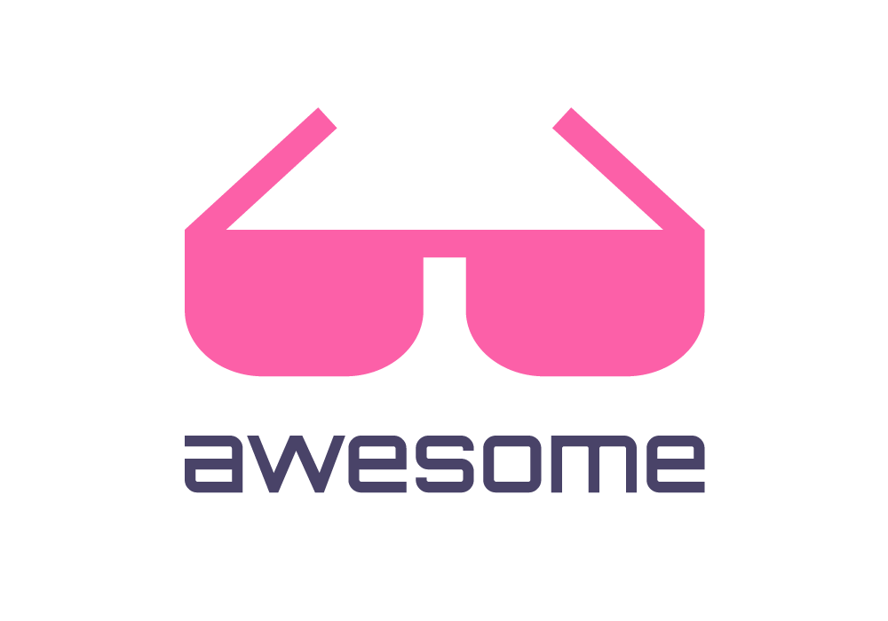
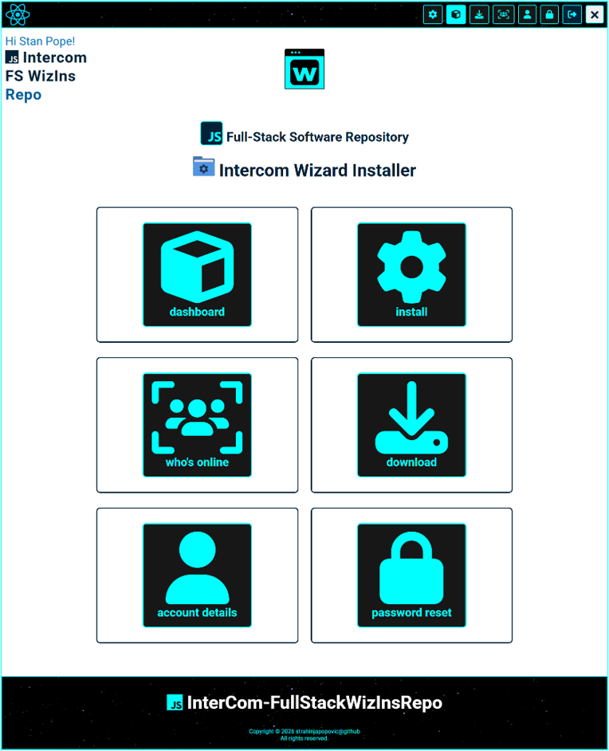
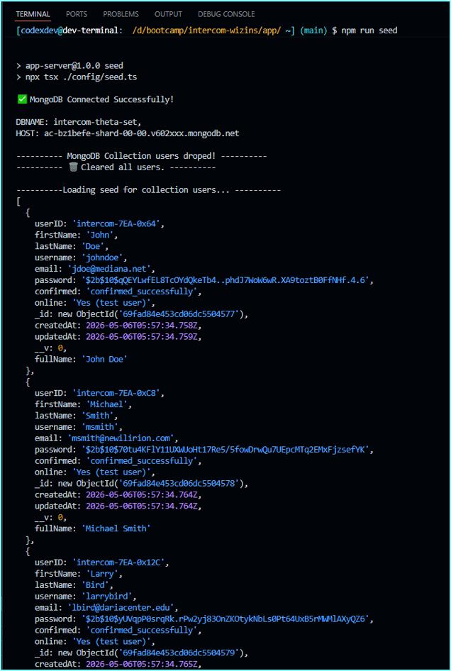
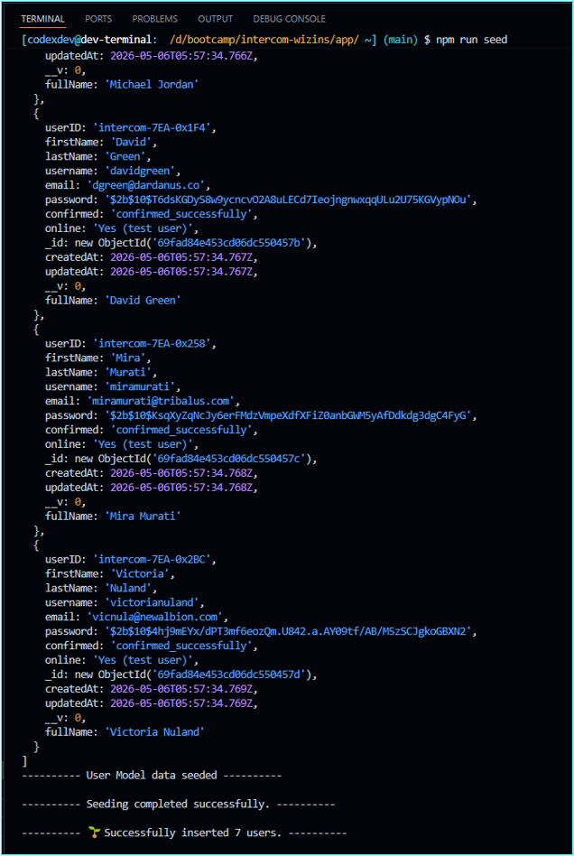
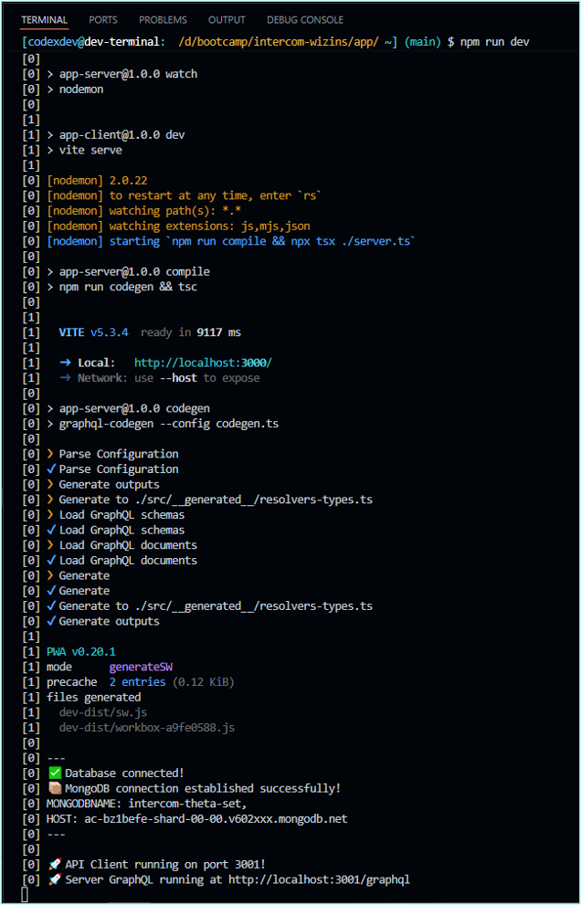

<div align="center">
  <h3>intercom-wizins</h3>
  <h3>🚀 MERN Project - Full Stack Repository</h3>
</div>

<p align="center">
  
</p>

<p align="center">
    
    
    
    
    
    
</p>

<p align="center">
  <a href="">
    
  </a>
  <a href="">
    
  </a>
  <a href="">
    
  </a>
  <a href="https://nodejs.org/en">
    
  </a>
  <a href="https://nodejs.org/en">
    
  </a>
  <a href="">
    
  </a>
  <a href="https://docs.npmjs.com/about-npm#getting-started">
    
  </a>
  <a href="https://www.npmjs.com/package/json5">
    
  </a>
</p>

<p align="center">
   
  
   
   
   
   
  <imga src="https://img.shields.io/npm/v/%40apollo%2Fserver?logo=apollo&label=%F0%9F%9A%80%20%40apollo%2Fserver%20npm" />
</p>

<p align="center">
  <a href="https://opensource.org/licenses/MIT">
    
  </a> 
</p>

<div align="center">
  <p>
    <a href="https://twitter.com/stanpopovic">
      
    </a>
  </p>
  <p>
    <a href="https://www.youtube.com/@strahinja-popovic-ch">
      
    </a>
  </p>
</div>

# intercom-wizins


## MERN Project - Full Stack Repository

### MERN Project, a full-stack, client-serveer monolitic repository (monorepo) and application with Node.js v26.0.0, NPM-v11.12.1, React-v19.2.6, Vite-v8.0.13,ApolloServer-v5.5.1, GraphQL-16.13.1, TypeScript-v6.0.3, ReactRouter-v7.15.1, Express.js-v5.2.1, MongoDB-npm-driver-library-v7.2.0, Mongoose-v9.6.1, PWA, AWS S3, SCSS, EmailJS and more ...

<a id="table-of-content"></a>
## Table of Content

- [Description Info](#description-info)
- [GitHub Repository Badge](#github-repository-badge)
- [Installation Process](#installation-process)
- [Usage Info](#usage-info)
- [Contributing Guidelines](#contributing-guidelines)
- [Test Instructions](#test-instructions)
- [Live on render](#live-on-render)
- [License](#license)
- [Questions and Contacts](#questions-and-contacts)


 Altrnatively, use the "Table of Contents" menu on the top-right corner to explore the list. 

<a id="description-info"></a>
## Description Info

Intercom Wizard Installer or intercom-wizins repo application is build as a client-server architecture that uses Apollo Server as a comprehensive GraphQL Server/ Client configuration engine formed of two layers server/ and client/ while using GraphQL as a single proxy API endpoint. 

`Client` layer uses queries and mutations and performs all GraphQL transactions at proxy port 3001 while server normaly operates at port 3000, in our example. Directory client/ includes all the contents of basic template react-vite files and folders (public/, src/, index.html, .eslintrc.cjs, vite.config.js) that are pre-defined by running cmd `npm run dev` for development or running cmd `npm run build` for production built and all that by executing actions script at app/client/package.json file. Queries and mutations are part of utilities at client layer but execution ocurred at server level and sending back to client at single API endpoint actual GraphQL proxy gateway. See file tree below (Grouping by file type approach is used). 

>intercom-wizins/app/client/

```bash
intercom-wizins/
├─ .vscode/
│  └─ settings.json
├─ app/
│  ├─ client/
│  │  ├─ dev-dist/
│  │  │  ├─ registerSW.js
│  │  │  ├─ sw.js
│  │  │  ├─ workbox-9637eeee.js
│  │  │  └─ workbox-a9fe0588.js
│  │  ├─ dist/
│  │  │  ├─ assets/
│  │  │  ├─ manifest.webmanifest
│  │  │  ├─ registerSW.js
│  │  │  ├─ sw.js
│  │  │  ├─ vite.svg
│  │  │  └─ workbox-4b7ad3f1.js
│  │  ├─ public/
│  │  ├─ src/
│  │  │  ├─ assets/
│  │  │  │  ├─ images/
│  │  │  │  └─ react.svg
│  │  │  ├─ components/
│  │  │  │  ├─ checkbox/
│  │  │  │  │  └─ index.tsx
│  │  │  │  ├─ dashboard/
│  │  │  │  │  ├─ children/
│  │  │  │  │  │  ├─ DashLink.jsx
│  │  │  │  │  │  ├─ DetailsLink.jsx
│  │  │  │  │  │  ├─ DownloadLink.jsx
│  │  │  │  │  │  ├─ ResetPassLink.jsx
│  │  │  │  │  │  └─ UserOnline.jsx
│  │  │  │  │  ├─ parent/
│  │  │  │  │  │  └─ ProfileParent.jsx
│  │  │  │  │  └─ skeletoncomp/
│  │  │  │  │     └─ DashSkeleton.jsx
│  │  │  │  ├─ datarow/
│  │  │  │  │  ├─ DataRowChild.jsx
│  │  │  │  │  └─ DataRowParent.jsx
│  │  │  │  ├─ dialogbox/
│  │  │  │  │  ├─ deleteuserdialog.jsx
│  │  │  │  │  ├─ dialog.jsx
│  │  │  │  │  └─ style.scss
│  │  │  │  ├─ download/
│  │  │  │  │  ├─ index-mobile.jsx
│  │  │  │  │  └─ index.jsx
│  │  │  │  ├─ error/
│  │  │  │  │  ├─ errorSignup.jsx
│  │  │  │  │  └─ errorUnauthorisedAccess.jsx
│  │  │  │  ├─ footer/
│  │  │  │  │  └─ index.jsx
│  │  │  │  ├─ header/
│  │  │  │  │  └─ index.jsx
│  │  │  │  ├─ home/
│  │  │  │  │  ├─ index-mobile.jsx
│  │  │  │  │  └─ index.jsx
│  │  │  │  ├─ installLink/
│  │  │  │  │  └─ index.jsx
│  │  │  │  ├─ spinner/
│  │  │  │  │  └─ spinnerLoader.jsx
│  │  │  │  ├─ title/
│  │  │  │  │  └─ index.jsx
│  │  │  │  └─ updateuserstatus/
│  │  │  │     ├─ useronlinestatus.tsx
│  │  │  │     └─ useronlinestatusclone.tsx
│  │  │  ├─ pages/
│  │  │  │  ├─ Details.tsx
│  │  │  │  ├─ Download.tsx
│  │  │  │  ├─ ForgotPassword.tsx
│  │  │  │  ├─ ForgotPasswordClone.tsx
│  │  │  │  ├─ Home.tsx
│  │  │  │  ├─ Login.tsx
│  │  │  │  ├─ Profile.tsx
│  │  │  │  ├─ ResetPassword.tsx
│  │  │  │  ├─ RouteErrorPage.tsx
│  │  │  │  ├─ Signup.tsx
│  │  │  │  ├─ SignupError.tsx
│  │  │  │  └─ UserOnline.tsx
│  │  │  ├─ utils/
│  │  │  │  ├─ graphql/
│  │  │  │  │  ├─ mutations.ts
│  │  │  │  │  └─ queries.ts
│  │  │  │  ├─ alphaNumStr.ts
│  │  │  │  ├─ authent.ts
│  │  │  │  └─ specCharStr.ts
│  │  │  ├─ App.css
│  │  │  ├─ App.jsx
│  │  │  ├─ custom.d.ts
│  │  │  └─ main.jsx
│  │  ├─ types/
│  │  │  └─ types.ts
│  │  ├─ .eslintrc.cjs
│  │  ├─ index.html
│  │  ├─ package-lock.json
│  │  ├─ package.json
│  │  ├─ tsconfig.json
│  │  └─ vite.config.js
│  ├─ utils/
│  │  └─ auth.ts
│  ├─ .env
│  ├─ .env.Example
│  ├─ package-lock.json
│  ├─ package.json
│  └─ tsconfig.json
├─ images/
│  ├─ intercom-wizins-download-preview.png
│  ├─ intercom-wizins-seed-preview.png
│  ├─ wizard-small-favicon.png
│  ├─ wizins-favicon-wLogo.png
│  ├─ wizins-js-logo-aqua.png
│  └─ wizins-mongodb-install.png
├─ .gitignore
├─ LICENSE
└─ README.md
```

`Server` utilise express.js framework, apollo server, apollo express middleware, static files, assigning type definitions and resolvers to apollo server and GraphQL, releasing connection with DB over GraphQL and turning on apollo server. Directory server/ include all server-side config architecture necessary to build and establish connection with database, to provide DB seeding of testing data and maintain ongoing DB transactions ect., e.g. (models/, schemas/, config/, utils/, seeders/, server.js). 

>intercom-wizins/app/server/

```bash
intercom-wizins/
├─ .vscode/
│  └─ settings.json
├─ app/
│  ├─ server/
│  │  ├─ config/
│  │  │  ├─ connection.ts
│  │  │  └─ seed.ts
│  │  ├─ models/
│  │  │  └─ User.ts
│  │  ├─ schemas/
│  │  │  ├─ resolvers.ts
│  │  │  ├─ schema.graphql
│  │  │  └─ typeDefs.ts
│  │  ├─ seeders/
│  │  │  └─ user-seeds.json
│  │  ├─ src/
│  │  │  └─ __generated__/
│  │  │     └─ resolvers-types.ts
│  │  ├─ utils/
│  │  │  └─ utils.ts
│  │  ├─ codegen.ts
│  │  ├─ package-lock.json
│  │  ├─ package.json
│  │  ├─ server.ts
│  │  ├─ tsconfig.json
│  │  └─ tsconfig.tsbuildinfo
│  ├─ utils/
│  │  └─ auth.ts
│  ├─ .env
│  ├─ .env.Example
│  ├─ package-lock.json
│  ├─ package.json
│  └─ tsconfig.json
├─ images/
│  ├─ intercom-wizins-download-preview.png
│  ├─ intercom-wizins-seed-preview.png
│  ├─ wizard-small-favicon.png
│  ├─ wizins-favicon-wLogo.png
│  ├─ wizins-js-logo-aqua.png
│  └─ wizins-mongodb-install.png
├─ .gitignore
├─ LICENSE
└─ README.md
```

The root dir is `intercom-wizins/` directory which is our project name directory. Then, we have `app/` directory inside and again inside app/ we have two main folders which are `server/` and `client/`. Because of use of Apollo client-server architecture and utility as GraphQL API endpoint, usuall directory configuration and content which relied on classic Model-View-Controller (MVC) architecture have to be adjusted. At sever-side we would have e.g. server/schema.js and server/resolvers.js OR server/schemas/typeDef.js and server/schemas/resolvers.js like in our example. In typeDef.js we should define all types and their fields as a blueprint which is actuall basic sceleton of data types and their properties. At resolvers.js we define resolvers functions for each used type and field in typeDefs.js. Those are the basic steps in forming directory, files and folders structure. Later on we add more components, pages and utilities to the project. 

>intercom-wizins/app/

```bash
intercom-wizins/
├─ .vscode/
│  └─ settings.json
├─ app/
│  ├─ client/
│  ├─ server/
│  ├─ utils/
│  ├─ .env
│  ├─ .env.Example
│  ├─ .nvmrc
│  ├─ eslint.config.js
│  ├─ package-lock.json
│  ├─ package.json
│  └─ tsconfig.json
├─ images/
├─ .gitignore
├─ LICENSE
└─ README.md
```

File tree abow describes general wiev of project's root directory with main files like server/ and client/.

### Application overview in production at dashboard location

[](./images/intercom-wizins-dash-preview.png)

<a id="github-repository"></a>
## GitHub Repo Badge
[](https://github.com/strahinjapopovic/intercom-wizins)

<a id="installation-process"></a>
## Installation Process
### As MongoDB will be used as a document database model it should be installed at first [MongoDB Installation Package](https://www.mongodb.com/try/download/community-kubernetes-operator). Click on the button download and start downloading MongoDB Windows installation package (`mongodb-windows-x86_64-7.0.12-signed.msi`). Also, before start make a empty dir on `C` drive (`C:>mkdir -p data/db`). Start MongoDB Setup Wizard and follow instructions. Setup type should be `Complete`, not Custom, Configuration as `Run service as Network Service user`, also install MongoDB Compass, press `next` and `install`. 

### Configurate MongoDB on Windows
Navigate to the bin directory of already instolled MongoDB on your machine and copy path (`C:\Program Files\MongoDB\Server\6.0\bin`) and go to Edit The System Environment Variables (System Properties) at your PC. After went to `Environment Variables` section, click on the `Path` at User Variables window and press `Edit` button. Click on button `New` and past previously copied path to MongoDB bin directory and press `Ok`. Check your MongoDB is working type in Git Bash terminal as follows (`[user@host: c/users/jdoe/~] $ mongod`): 

```bash
$ mongod
```
If terminal shows something like image below it means MongoDB is set properly. Othrewise repeat process again.

[](./images/wizins-mongodb-install.png)

After MongoDB is setup, npm packages should be installed at root dir of the application (`inter-com-wizins/app`):
To initialize package.json and to install node_packages run
```bash
$ npm init -y # initialize formating of package.json with answer "yes" to confirm init
$ npm install # installing node packages
```

To install mongodb npm packages run
```bash
$ npm install mongodb 
```

To install mongoose npm packages run
```bash
$ npm install mongoose
```

### Populate database with testing data
Seed data are stored in `user-seeds.json` file (`app/server/seeders/user-seeds.json`) and you can execute it from `app/server/config/seed.js` as follows:
```bash
$ node ./config/seed.js # execute from server/ dir
```
Alternatively,
```bash
$ npm run seed # automate executable shortcuts scripts at package.json from app/ dir
```
## Seed output:
>npm run seed

### IMG-1 
[](./images/intercom-wizins-seed-preview.png)

### IMG-2 
[](./images/intercom-wizins-seed-preview-2.png)

<a id="usage-info"></a>
## Usage Info

<a id="contributing-guidelines"></a>
## Contributing Guidelines

Currentlly, at this stage there is no contributors but for more information any enquiry can be reffered to Question and Contact section.

<a id="test-instructions"></a>
## Test Instructions

Application runs by invoking command `$ npm run dev` from root `intercom-wizins/app>` directory if you using scripts at package.json. Before running application, download compressed repo from githaub and installl packages globaly or at application root directory from the section [Installation Process](#installation-process). 

Install TypeScript, TypeScript Execute and Concurrently packages at once
```bash
$ npm install --save-dev typescript tsx concurrently # under packages of npm you would have npx runner and under typescript you should have tsc compiler automatically installed.
```

## Starting server from terminal without scripts
To start GraphQL server from root directory at http://localhost:3001/graphql
```bash
$ npx watch ./server/server.ts # OR node ./server/server.js 
```
To start Client-side from root dir at http://localhost:3000
```bash
$ cd client && npm run dev
```
Start server and client at once by using concurrently with no scripts
```bash
$ concurrently "cd ./server && npx tsx watch server.ts" "cd ./client && npx vite"
```
Install nodemon is optional
```bash
$ npm install --save-dev nodemon # nodemon runs "start" script at first run
```

## Starting server on scripts
If using scripts from root dir
```bash
$ npm run dev # it will start both server and client side ports at once (http://localhost:3000 AND http://localhost:3001/graphql)
```

## Server dev output: 
>npm run dev

### IMG-1
[](./images/server-start-npm-run-dev.png)

All automate executable scripts that call server's and client's package.json scripts are stored at root directory `intercom-wizins/app/` in `package.json` file.
>intercom-wizins/app/package.json

```json
"scripts": {
    "start": "nodemon ./server/server.ts",
    "dev": "concurrently \"npm run dev:server\" \"npm run dev:client\"",
    "dev:server": "cd ./server && npm run watch",
    "dev:client": "cd ./client && concurrently \"npm run codegen:watch\" \"npm run dev\"",
    "build": "cd ./client && npm run build",
    "seed": "cd ./server && npm run seed",
    "codegen:client": "npm run codegen:watch -w client",
    "lint": "eslint .",
    "preview": "cd ./client && npm run preview"
  },
```
>intercom-wizins/app/server/package.json

By executing scripts `"watch": "nodemon"` from `server/package.json` file we actually turning on all "scripts" under it, excluding "seed". This executes our `server.ts` file with all middleware backend utilities and generates `src/_generated__/resolvers-types.ts` file as a main type file to be used at resolvers.ts.
```json
"scripts": {
    "seed": "npx tsx ./config/seed.ts",
    "codegen": "graphql-codegen --config codegen.ts",
    "compile": "npm run codegen && tsc",
    "start": "npm run compile && tsx ./server.ts",
    "watch": "nodemon"
  },
```
>intercom-wizins/app/client/package.json

By executing scripts `"codegen:watch": "graphql-codegen --watch"` from `client/package.json` 
```json
"scripts": {
    "dev": "vite",
    "build": "tsc --build && vite build",
    "preview": "vite preview",
    "compile": "graphql-codegen",
    "codegen:watch": "graphql-codegen --watch"
  },
```
<a id="live-on-render"></a>
## Live on [Render](https://js-wizard.onrender.com/)

Live application can be visited [here](https://js-wizard.onrender.com/).

[](https://js-wizard.onrender.com/)

## License

Copyright © 2024, [codexdev](https://github.com/strahinjapopovic). Released under the [MIT License](./LICENSE).

<a id="questions-and-contacts"></a>
## Questions and Contacts

Questions about application can be reffered to the author's [GitHub account](https://github.com/strahinjapopovic) or you can [Contact Me](mailto:spope.mails@gmail.com) directly over an email.

