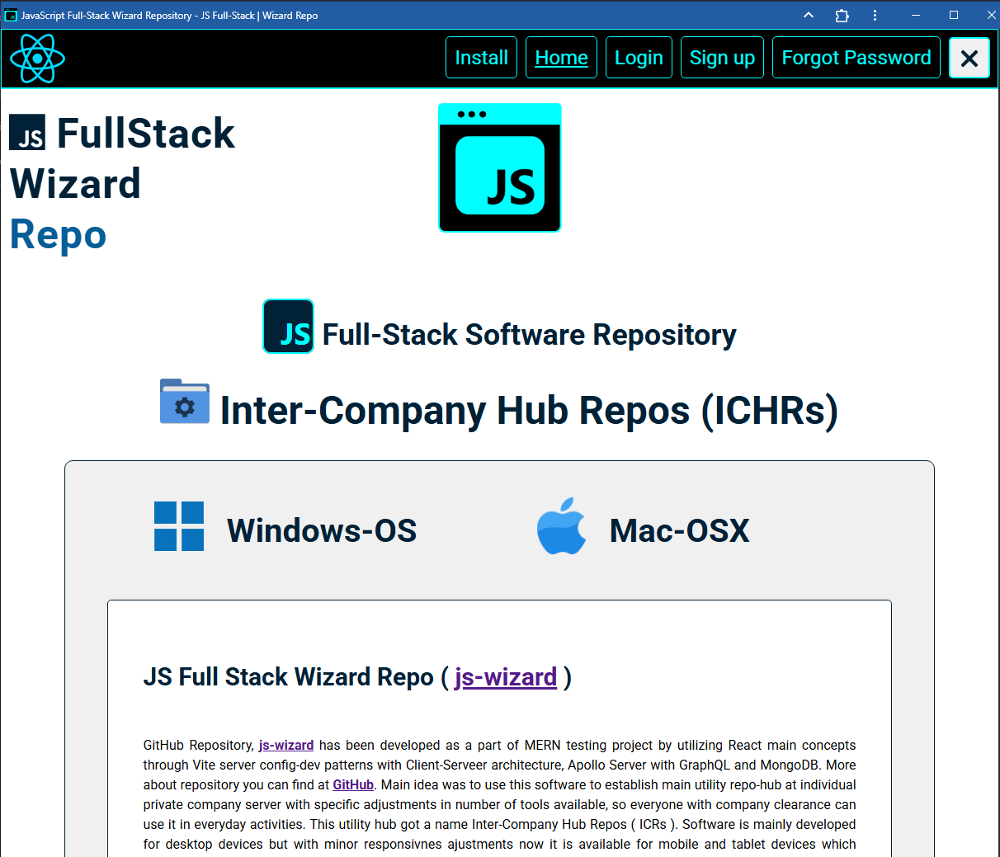
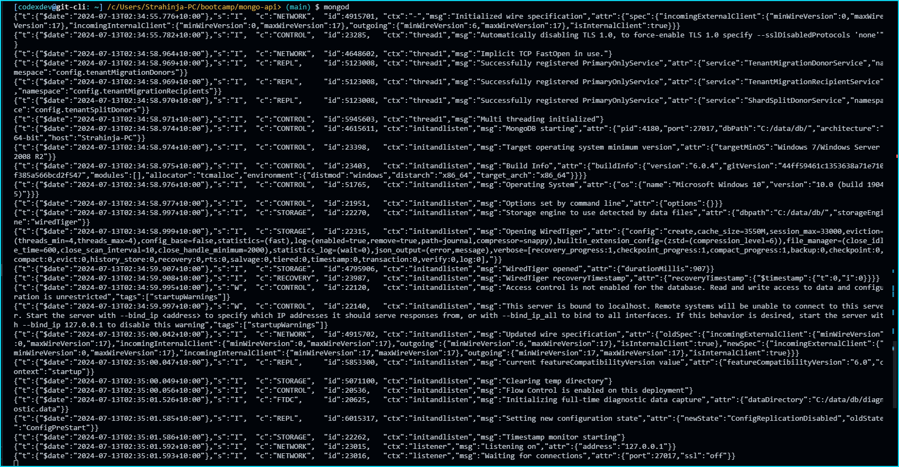
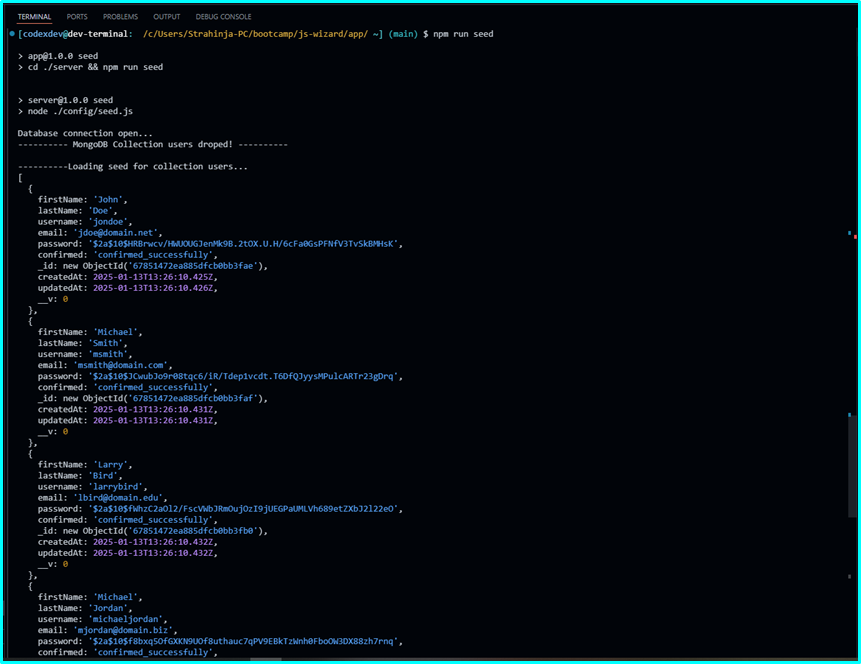
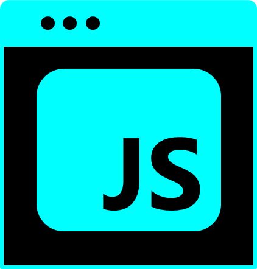

# js-wizard

## MERN Full-Stack Wizard Repository

      

<p align="left">
    
    
    
    
</p>
    
<p align="left">
    <a href="https://gist.github.com/Julien-Marcou/156b19aea4704e1d2f48adafc6e2acbf"></a>
    <a href="https://nodejs.org/en"></a>
    <a href="https://docs.npmjs.com/about-npm#getting-started"></a>
    <a href="https://www.npmjs.com/package/json5"></a>
</p>

<p align="left">
    <a href="https://twitter.com/stanpopovic"></a>
    <a href="https://www.youtube.com/@strahinja-popovic-ch"></a>
</p>

[](https://opensource.org/licenses/MIT) 

## MERN Full-Stack JS Client-Serveer architecture application with `React-v18.3.1`, `Node.js v22.0.0`, `NPM-v10.5.1`, `Express.js-v4.17.2`, `MongoDB-v6.8.0`, `Mongoose-v8.7.2`, `@apollo/server-v4.7.1`, Vite, GraphQL, PWA, AWS S3, EmailJS and more ...

<a id="table-of-content"></a>
## Table of Content

- [Description Info](#description-info)
- [GitHub Repository Badge](#github-repository-badge)
- [Installation Process](#installation-process)
- [Usage Info](#usage-info)
- [Contributing Guidelines](#contributing-guidelines)
- [Test Instructions](#test-instructions)
- [Live on render](#live-on-render)
- [License](#license)
- [Questions and Contacts](#questions-and-contacts)


Altrnatively, use the "Table of Contents" menu on the top-right corner to explore the list.

<a id="description-info"></a>
## Description Info

### JS-Wizard application is build as client-server architecture that uses two layers, Apollo Server and Apollo Client layers with GraphQL as a single proxy API endpoint. The `client` directory includes all the contents of basic template react-vite files and folders (`public/`, `src/`, `index.html`, `.eslintrc.cjs`, `vite.config.js`) while `server` directory include all server-side config architecture necessary to build and establish connection with database, to provide DB seeding of testing data and maintain ongoing DB transactions ect., e.g. (`models/`, `schemas/`, `config/`, `utils/`, `seeders/`, `server.js`). The root dir is `~/app` directory. Rest of two main dirs are `~/app/server/` and `~/app/client/`. Because of use of Apollo Client-Server architecture and utility with GraphQL API endpoint usuall directory configuration and content which relied on classic Model-View-Controller (MVC) architecture have to be adjusted. At sever-side we would have e.g. `./schema.js` and `./resolvers.js` OR `schemas/typeDef.js` and `schemas/resolvers.js` like in our example. In typeDef.js we should define all types and their fields as a blueprint which is actuall basic sceleton of data types and their properties. At resolvers.js we define resolvers functions for each used type and field in typeDefs.js. Those are the basic steps in forming directory, files and folders structure. Later on we add more components, pages and utilities to the model.

[](./screenshots/js-wizard-onrender-online-preview.png)

<a id="github-repository"></a>
## GitHub Repo Badge
[](https://github.com/strahinjapopovic/js-wizard)

<a id="installation-process"></a>
## Installation Process
### As MongoDB will be used as a document database model it should be installed at first [MongoDB Installation Package](https://www.mongodb.com/try/download/community-kubernetes-operator). Click on the button download and start downloading MongoDB Windows installation package (`mongodb-windows-x86_64-7.0.12-signed.msi`). Also, before start make a empty dir on `C` drive (`C:>mkdir -p data/db`). Start MongoDB Setup Wizard and follow instructions. Setup type should be `Complete`, not Custom, Configuration as `Run service as Network Service user`, also install MongoDB Compass, press `next` and `install`. 

### Configurate MongoDB on Windows
Navigate to the bin directory of already instolled MongoDB on your machine and copy path (`C:\Program Files\MongoDB\Server\6.0\bin`) and go to Edit The System Environment Variables (System Properties) at your PC. After went to `Environment Variables` section, click on the `Path` at User Variables window and press `Edit` button. Click on button `New` and past previously copied path to MongoDB bin directory and press `Ok`. Check your MongoDB is working type in Git Bash terminal as follows (`[user@host: c/users/jdoe/~] $ mongod`): 

```bash
$ mongod
```
If terminal shows something like image below it means MongoDB is set properly. Othrewise repeat process again.

[](./images/mongo-install-bord.PNG)

After MongoDB is setup, npm packages should be installed at root dir of the application (`~/js-wizard/app>`):
To initialize package.json and to install node_packages run
```bash
$ npm init -y # initialize formating of package.json with answer "yes" to confirm init
$ npm install # installing node packages
```

To install mongodb npm packages run
```bash
$ npm install mongodb 
```

To install mongoose npm packages run
```bash
$ npm install mongoose
```

### Populate database with testing data
Seed data are stored in `user-seeds.json` file (`~/app/server/seeders/user-seeds.json`) and you can execute it from `app/server/config/seed.js` as follows:
```bash
$ node ./config/seed.js # execute from server/ dir
```
Alternatively,
```bash
$ npm run seed # automate executable shortcuts scripts at package.json from app/ dir
```
### Run seed output:
[](./images/mongo-seed-bord.PNG)

<a id="usage-info"></a>
## Usage Info

<a id="contributing-guidelines"></a>
## Contributing Guidelines

Currentlly, at this stage there is no contributors but for more information any enquiry can be reffered to Question and Contact section.

<a id="test-instructions"></a>
## Test Instructions

Application runs by invoking command `$ npm run dev` at `~/js-wizard/app>` directory. Before running application, download compressed repo from githaub and installl packages globaly or at application root directory from the section [Installation Process](#installation-process). 

Install nodemon npm package globaly
```bash
$ npm install -g nodemon
```

To start server from root directory at http://localhost:3001/graphql
```bash
$ nodemon ./server/server.js # OR node ./server/server.js 
```

To start client-side from root dir at http://localhost:3000
```bash
$ cd client && npm run dev
```

Alternatively, install concurrently npm package globaly
```bash
$ npm i -g concurrently
```
Start server and client ports at once
```bash
$ concurrently "cd ./server && npm run watch" "cd ./client && npm run dev"
```

If using scripts to start both ports
```bash
$ npm run dev # it will start both server and client side ports at once (http://localhost:3000 AND http://localhost:3001/graphql)
```

All automate executable scripts are stored at root directory `~/js-wizard/app>` in `package.json` file.
```json
"scripts": {
    "start": "nodemon ./server/server.js",
    "dev": "concurrently \"cd ./server && npm run watch\" \"cd ./client && npm run dev\"",
    "build": "concurrently \"cd ./server && npm run watch\" \"cd ./client && npm run build\"",
    "install": "cd ./server && npm install && cd ../client && npm install",
    "seed": "cd ./server && npm run seed",
    "cbuild": "cd ./client && npm run build"
  },
```

<a id="live-on-render"></a>
## Live on [Render](https://js-wizard.onrender.com/)

Live application can be visited [here](https://js-wizard.onrender.com/).

[](https://js-wizard.onrender.com/)

## License

Copyright © 2024, [codexdev](https://github.com/strahinjapopovic). Released under the [MIT License](./LICENSE).

<a id="questions-and-contacts"></a>
## Questions and Contacts

Questions about application can be reffered to the author's [GitHub account](https://github.com/strahinjapopovic) or you can [Contact Me](mailto:spope.mails@gmail.com) directly over an email.

